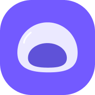

<div align="center">
  <br/>
   
  <h1>MOZI</h1>
     
      
     <!-- [](https://dashboard.cypress.io/projects/zyvbtc/runs) -->
    <!--  -->
</div>

## 목차

1. [**서비스 소개**](#1)
2. [**기술스택**](#2)
3. [**실행 방법**](#3)
4. [**개발자 및 프로젝트에 도움을 주신 분들**](#4)
5. [**MOZI 공식문서**](https://mozi.vercel.app/blog)
6. [**디자인**](https://www.figma.com/file/eyC5lWrJFnF0q7g3YSstD0/MOZI?node-id=0%3A1)
7. [**스토리북**](https://634bb73decf851b7e9bcd559-ozmokojofk.chromatic.com/)
8. [**팀 노션**](https://roomy-phone-06d.notion.site/MOZI-92625391b533460fb797bbce9f8839dfs)

<div id="1"></div>

## 서비스 소개

**MOZI**는 글을 메모할 때 사용되는 `메모지`에서 뒤에 두글자를 떼어내어 만들어진 이름입니다.

MOZI는 할 일을 잊지 않기 위한 시간/장소 기반 TODO서비스 입니다. 사용자가 지정한 시간이나 장소에 기반하여 그 장소에 근접하거나 특정 시간이 되면 알림을 보내줌으로써 사용자가 할 일을 잊지 않고 할 수 있도록 도와줍니다.

MOZI는 PWA의 형태로 제작되어서 웹에 접속 가능한 환경이라면 어디서든 접속 및 다운로드 할 수 있으며, 오프라인 동기화 기능을 제공하여 인터넷이 연결되지 않은 환경에서도 사용할 수 있습니다.

MOZI의 사용법이 궁금하시다면 [MOZI 공식문서의 튜토리얼](https://mozi.vercel.app/docs/intro) 부분을 읽어보시는것을 추천합니다.

<div id="2"></div>

## 기술 스택

<p align="center">
  
</p>

- **PWA**를 적용하여 웹 브라우저에서 다운로드가 가능하도록 구현하였고 반응형 UI로 크로스 플랫폼을 지원할 수 있도록 했으며, PWA에서 활용할 수 있는 핵심 기능인 웹 푸시와 백그라운드 동기화 기능을 활용해 웹이지만 사용자가 네이티브 앱을 사용하는 것처럼 사용할 수 있도록 구현했습니다.
- **Next**의 SSR를 활용해 SEO를 향상시켰고 Vercel 플랫폼을 활용하여 짧은 주기로 지속적 배포를 진행했습니다.
- **React**를 사용하여 컴포넌트를 재사용하고 사용자와 상호작용이 많은 페이지를 효율적으로 구현했습니다.
- **TypeScript**를 사용하여 타입 안정성을 보장하고, 코드의 가독성을 높였습니다.
- **React Query**를 사용하여 Data Fetching 로직을 작성하였고 전역 상태관리자처럼 사용해 데이터를 관리했습니다.
- **styled-components**를 사용하여 애플리케이션의 스타일을 체계적으로 관리합니다.
- **Cypress**를 사용하여 사용자의 행동을 시뮬레이션하여 E2E 테스트를 진행했습니다.
- **Jest**를 사용하여 TDD(테스트 주도 개발)를 부분적으로 적용하여 각 모듈에 대한 단위 테스트를 진행했습니다.
- **Storybook**를 사용하여 CDD(컴포넌트 주도 개발)을 진행했습니다.
- **Docker**를 사용하여 애플리케이션을 컨테니어화하여 배포를 진행합니다.
- **NGINX**를 사용하여 웹서버를 구성했습니다.

<div id="3"></div>

## 시스템 아키텍처

<p align="center">
  
</p>

## 💻 실행 방법

개발환경: `Node.js v16.15.1`, `MacOS Monterey 12.2.1`

### Development Mode

```sh
yarn install
yarn dev
```

### Production Mode

```sh
yarn build
yarn start
```

<div id="4"></div>

## 개발자 및 프로젝트에 도움을 주신 분들

<table>
  <tr>
    <td align="center" width="150px">
      <a href="https://github.com/hyunjinee" target="_blank">
        
      </a>
    </td>
    <td align="center" width="150px">
      <a href="https://github.com/HanCiHu" target="_blank">
        
      </a>
    </td>
    <td align="center" width="150px">
      <a href="https://github.com/sion-k" target="_blank">
        
      </a>
    </td>
    <td align="center" width="150px">
      <a href="https://github.com/SangsooNam" target="_blank">
        
      </a>
    </td>
    <td align="center" width="150px">
      <a href="https://github.com/dobestan" target="_blank">
        
      </a>
    </td>
     <td align="center" width="150px">
      <a href="https://github.com/minjang" target="_blank">
        
      </a>
    </td>
     <td align="center" width="150px">
      <a href="https://github.com/gv0413" target="_blank">
        
      </a>
    </td>
  </tr>
  <tr> 
   <td align="center">
      <a href="https://github.com/hyunjinee" target="_blank">
        이현진<br /> 
        Frontend
      </a>
    </td>
    <td align="center">
      <a href="https://github.com/HanCiHu" target="_blank">
        유찬희<br />
        Frontend
      </a>
    </td>
    <td align="center">
      <a href="https://github.com/sion-k" target="_blank">
        김시온<br />
        Backend
      </a>
    </td>
    <td align="center">
      <a href="https://github.com/sangsoo" target="_blank">
        남상수 멘토님<br />
      </a>
      <a href="https://www.spotify.com/">Spotify</a>
    </td>
    <td align="center">
      <a href="https://github.com/dobestan" target="_blank">
        안수찬 멘토님<br />
      </a>
      <a href="https://www.thebold.co.kr/">BOLD</a>
    </td>
    <td align="center">
      <a href="https://github.com/minjang" target="_blank">
        김민장 멘토님<br />
      </a>
      <a href="https://about.facebook.com/ko/meta/">Facebook</a>
    </td>
    <td align="center">
      <a href="https://github.com/gv0413" target="_blank">
        목민주 멘토님<br />
      </a>
      <a href="https://kakaoenterprise.com/">Kakao Enterprise</a>
    </td>
  </tr>
</table>
